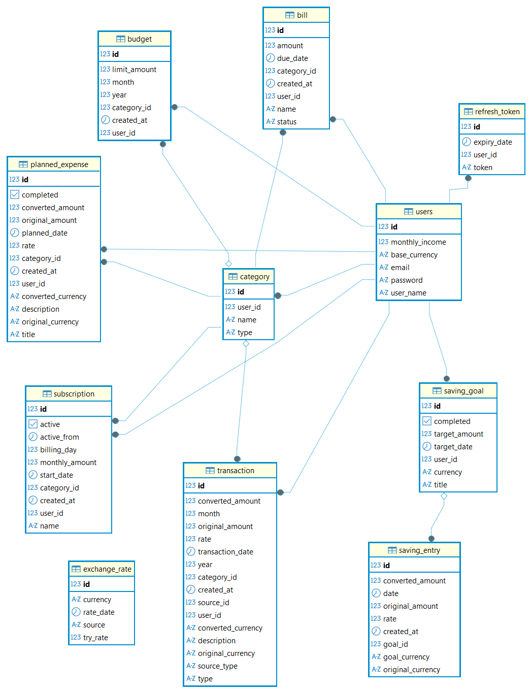

## 💰 Personal Finance & Savings Management System

>A multi-user financial management backend application built with Spring Boot and RESTful architecture.  
It allows users to track income and expenses, manage budgets, handle subscriptions, plan future expenses, and set currency-based savings goals.
---
### 🚀 Features
- 🔐 JWT-based authentication (Access + Refresh Token)
- 👤 Multi-user data isolation
- 📂 Category-based income & expense tracking
- 💳 Multi-currency transaction support
- 💸 Monthly & category-based budget control
- 🔁 Automatic subscription expense generation
- 🧾 Bill (due-based expense) management
- 💰 Monthly fixed income automation
- 📅 Future expense planning
- 💱 Daily exchange rate integration (Central Bank)
- 🎯 Currency-based savings goals
- 📊 Budget warnings & financial reporting support
- 📚 OpenAPI 3 documentation (Swagger UI)
---
### ⚙️ Tech Stack
- Java 17+
- Spring Boot
- Spring Security (JWT)
- Spring Data JPA (Hibernate)
- PostgreSQL
- Lombok
- OpenAPI / Swagger (Springdoc)
- RESTful API Architecture
---
### 🧱 Architecture

```
controller/
service/
    ├── impl/
repository/
model/
   ├── entity/
   └── enums/
dto/
   ├── request/
   └── response/ 
security/
currency/
exception/
config/

```
---
### 📚 API Documentation
```
Swagger UI:
http://localhost:8080/swagger-ui/index.html

OpenAPI JSON:
http://localhost:8080/v3/api-docs
```

#### Main Endpoint Groups
- /api/auth
- /api/users
- /api/categories
- /api/transactions
- /api/budgets
- /api/bills
- /api/subscriptions
- /api/planned-expenses
- /api/saving-goals
- /api/reports
---
### 🔐 User Management & Security
- JWT-based authentication
- Access Token + Refresh Token generation & rotation
- Stateless security filter chain
- BCrypt password hashing
- All operations executed via authenticated user context
- Prevention of cross-user data access
- GlobalExceptionHandler for structured error responses
---
### 💱 Exchange Rate System
- TCMB XML API integration (Central Bank)
- TRY-based cross-rate conversion
- Daily exchange rate fetching
- Update logic after official release time (15:30)
- Rate DB cache with history table
- Fallback strategy: DB today → API → DB latest → static
---
### 📂 Category Management
- Category structure: `name + TransactionType (INCOME / EXPENSE)`
- INCOME categories cannot be used for expenses
- EXPENSE categories cannot be used for income
- User-specific category ownership
- Duplicate prevention caused by case/whitespace differences
- Budgets can only be assigned to EXPENSE categories
---

### 💳 Transaction Management
- Income & Expense tracking
- Multi-currency support
- Exchange rate conversion
- Budget validation during creation
- Source tracking via `TransactionSourceType`
- (MANUAL, SUBSCRIPTION, BILL, PLANNED_EXPENSE, MONTHLY_FIXED_INCOME)
- Dynamic filtering (month, year, type, category, sourceType, date range)
---

### 💸 Budget System
- Monthly total budget
- Category-based monthly budget
- Planned vs actual spending separation
- Duplicate prevention per month/year
- Soft-limit warning system (INFO <80%, WARNING ≥80%, EXCEEDED >100%)
---

### 🔁 Subscription System
- Recurring monthly expenses
- On-demand monthly transaction generation (no scheduler)
- Billing day restricted to 1–28 to simplify
- Active / Inactive control

---

### 🧾 Bill Management
- Due-date based expenses
- Automatic expense generation
- Pay action → generates transaction
- `BillStatus` (PAID, UNPAID, OVERDUE)
---

### 💰 Fixed Income
- Monthly recurring income generator
- Lazy generation on login
- Transaction date set to first day of month
- TransactionSourceType = MONTHLY_FIXED_INCOME
---

### 📅 Planned Expenses
- Future-dated expense creation
- Budget-aware planning
- Complete action → converts to transaction
- Included in budget calculations (actual vs planned)
---

### 🎯 Savings Goals
- Currency-based savings targets (e.g. 2000 USD)
- Saving entries with FX conversion
- Progress percentage calculation
- Overdue flag based on targetDate
---

### 📊 Reporting & Analytics
- All reports are calculated dynamically based on transactional data (no pre-aggregated tables)
- Monthly summary report
- 3-month trend report
- Expense category distribution report
- Budget, Subscription, Bill, SavingGoals, Planned Expenses detailed report


### 🗄️ Database Schema
Below is the relational database design of the system:
